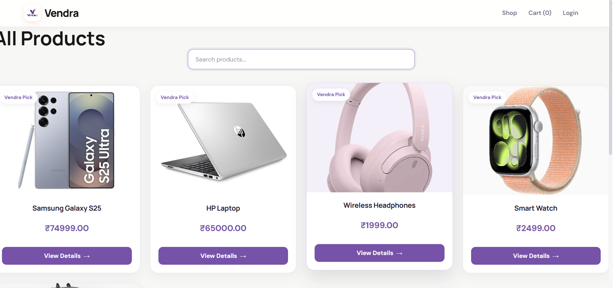
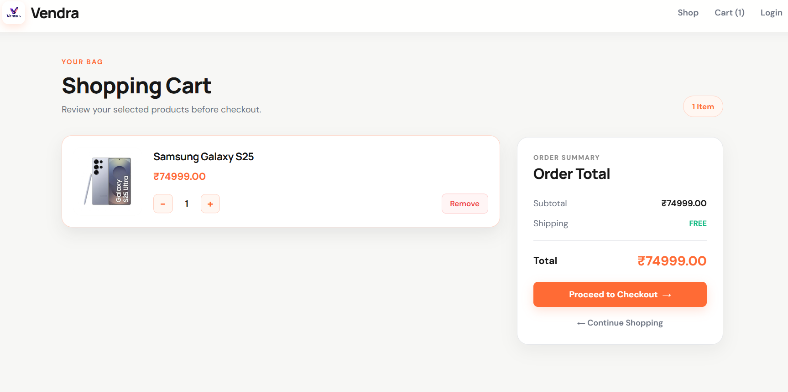
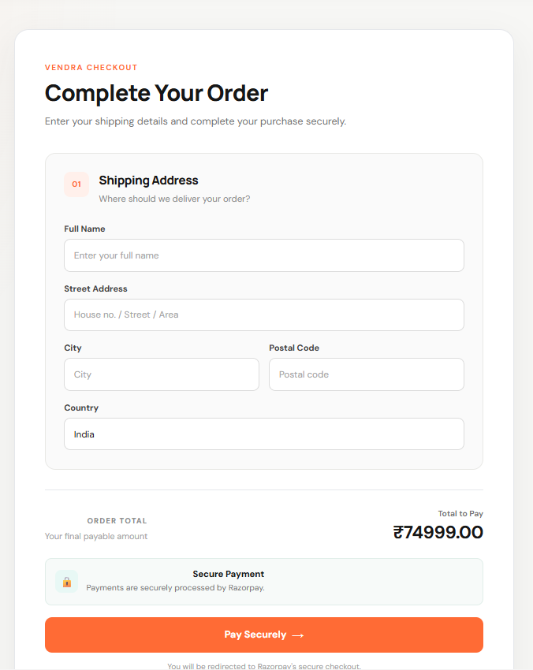
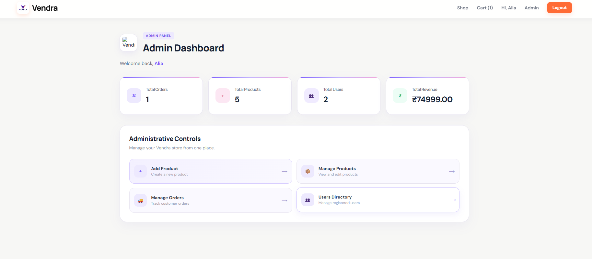

# Vendra 🛍️

A modern full-stack e-commerce web application built with **React.js, Node.js, Express.js, and MongoDB**.

Vendra provides a clean and responsive shopping experience with user authentication, product management, image uploads, cart functionality, checkout, online payments, and order management.

---

## ✨ Features

### 👤 User Features

* User Registration & Login
* JWT-based Authentication
* Secure Password Hashing
* User Profile
* Product Browsing
* Product Details
* Shopping Cart
* Checkout
* Order Placement
* Order Success Page

### 🛠️ Admin Features

* Admin Dashboard
* Add Products
* Edit Products
* Delete Products
* Product Image Upload
* Product Management
* Order Management

### 💳 Payment & Services

* Razorpay Payment Integration
* Cloudinary Image Upload & Storage
* Multer File Upload Handling
* Nodemailer Email Service

---

## 🛠️ Tech Stack

### Frontend

* React.js
* JavaScript
* HTML5
* CSS3
* React Router DOM
* Redux Toolkit
* React Redux
* Vite

### Backend

* Node.js
* Express.js
* REST APIs
* JWT
* bcryptjs
* Multer
* Cloudinary
* Nodemailer
* Razorpay
* CORS
* dotenv

### Database

* MongoDB
* Mongoose

### Development Tools

* Git
* GitHub
* VS Code
* Nodemon
* ESLint
* Concurrently

---

## 📁 Project Structure

```text
shopnest-full-stack/
│
├── frontend/
│   ├── public/
│   ├── src/
│   ├── package.json
│   └── ...
│
├── backend(1)/
│   ├── controllers/
│   ├── models/
│   ├── routes/
│   ├── middleware/
│   ├── package.json
│   └── server.js
│
├── package.json
├── .gitignore
└── README.md
```

---

## 🚀 Getting Started

### Prerequisites

Make sure you have installed:

* Node.js
* npm
* MongoDB

---

### 1. Clone the Repository

```bash
git clone YOUR_GITHUB_REPOSITORY_URL
```

```bash
cd shopnest-full-stack
```

---

### 2. Install Dependencies

From the root directory:

```bash
npm install
```

This project also provides a convenient installation command:

```bash
npm run install
```

---

### 3. Environment Variables

Create the required `.env` files for the backend and frontend.

Add your required configuration such as:

```env
MONGO_URI=your_mongodb_connection_string

JWT_SECRET=your_jwt_secret

CLOUDINARY_CLOUD_NAME=your_cloudinary_cloud_name
CLOUDINARY_API_KEY=your_cloudinary_api_key
CLOUDINARY_API_SECRET=your_cloudinary_api_secret

RAZORPAY_KEY_ID=your_razorpay_key
RAZORPAY_KEY_SECRET=your_razorpay_secret
```

Add any additional variables required by your project.

> **Never commit `.env` files, passwords, API keys, or other secrets to GitHub.**

---

## ▶️ Running the Project

### Run Frontend & Backend Together

```bash
npm run dev
```

### Run Backend Only

```bash
npm run dev:server
```

### Run Frontend Only

```bash
npm run dev:client
```

### Build Frontend

```bash
npm run build
```

---


## 📸 Screenshots:

### 🏠 Home Page


### 🛍️ Products Page



### 📦 Product Details


### 🛒 Cart



### 💳 Checkout



### 👨‍💼 Admin Dashboard



---

## 🌐 Live Demo

Coming soon.

---

## 👩‍💻 Author

**Ujala Chinchkhede**

Built with React, Node.js, Express.js and MongoDB.
